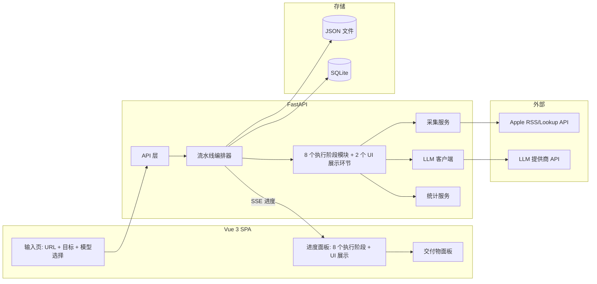

# App Review Insights —— 设计方案

> 版本：v1.0　|　日期：2026-08-13　|　状态：已确认关键决策，可进入实现
> 依据：retro-labs/app-review-insights 项目资料

---

## 0. 决策记录（Decision Log）

| # | 决策项 | 结论 | 说明 |
| --- | --- | --- | --- |
| D1 | 后端技术栈 | Python 3.11 + FastAPI | 数据分析生态、LLM SDK、异步支持 |
| D2 | 前端技术栈 | **Vue 3 + Vite**（SPA） | 用户确认；FastAPI 静态托管，单命令启动 |
| D3 | LLM 接入方式 | **内置常见提供商 + 用户选择后填 Key** | 用户确认；Provider Registry + OpenAI 兼容协议 |
| D4 | LLM 密钥存储 | 仅内存 + 请求头传递，不落盘 | 不进 `.env`、不进日志、不进缓存 |
| D5 | 数据采集 | Apple 官方 RSS Review Feed + iTunes Lookup API | 优于抓页面；节流合规 |
| D6 | 存储 | JSON 文件（`data/runs/{run_id}/`）+ SQLite（元数据） | 中间产物可离线评审 |
| D7 | 去重 | 精确去重（规范化 hash）+ 近似去重（分片 Jaccard ≥ 0.85） | 确定性规则，可解释 |
| D8 | 进度推送 | SSE（EventSource）+ 轮询兜底 | 简单可靠 |
| D9 | 结论区分 | `kind: model_derived / deterministic_stat` 字段 + UI 分区 | 满足 AI 要求 |

---

## 1. 总体架构



### 1.1 请求/运行生命周期

1. 用户填写：应用链接（或导入 JSON/CSV）+ 分析目标 + **模型提供商 + API Key** → 点击"开始"
2. 后端创建 `run_id`，将模型凭据放入**本次运行内存上下文**（不落盘）
3. 编排器按 8 个执行阶段顺序执行（阶段 9/10 为 UI 展示环节，由 SSE + 前端承担），每阶段产物即时落盘 `data/runs/{run_id}/`
4. SSE 推送阶段状态与中间结果；UI 实时渲染
5. 全部完成后 UI 展示交付物；运行元数据（含"缓存标注"）入 SQLite

---

## 2. 技术选型明细

| 层 | 选型 | 理由 |
| --- | --- | --- |
| 后端 | Python 3.11 + FastAPI + uvicorn | 异步、类型化、生态好 |
| LLM SDK | `openai` Python 包（OpenAI 兼容协议） | 一套代码兼容多提供商 |
| 前端 | Vue 3 + Vite + Vue Router + Pinia | SPA；状态管理清晰 |
| 前端构建产物 | FastAPI `StaticFiles` 托管 | 一条命令启动全栈 |
| 存储 | JSON 文件 + `sqlite3`（标准库） | 零额外依赖 |
| 采集 | `httpx`（异步）+ 节流 | 轻量 |
| 语言检测 | `langdetect`（备选：规则/模型） | 轻量可离线 |
| 测试 | `pytest` + `httpx` TestClient | 单测覆盖关键逻辑 |

---

## 3. LLM 集成设计（D3 / D4）

### 3.1 内置 Provider Registry

预置常用提供商，用户选择后自动带出默认 `base_url` 与候选模型，只需填 Key（Ollama 本地可留空）：

| 提供商 | 默认 Base URL | 候选模型（示例） | Key 必填 |
| --- | --- | --- | --- |
| OpenAI | `https://api.openai.com/v1` | `gpt-4o`, `gpt-4o-mini`, `o3-mini` | 是 |
| Anthropic | `https://api.anthropic.com/v1` | `claude-sonnet-4-20250514`, `claude-haiku-4-5-20251001` | 是 |
| DeepSeek | `https://api.deepseek.com/v1` | `deepseek-chat`, `deepseek-reasoner` | 是 |
| Google Gemini | `https://generativelanguage.googleapis.com/v1beta/openai` | `gemini-2.5-flash`, `gemini-2.5-pro` | 是 |
| 本地 Ollama | `http://localhost:11434/v1` | `llama3.1`, `qwen2.5`, `deepseek-r1` | 否 |
| 自定义 | 用户填写 | 用户填写 | 视厂商 |

- 提供商清单以 **JSON 配置**（`backend/app/llm/providers.json`）维护，新增厂商不改代码。
- 全部走 **OpenAI 兼容 `/chat/completions`** 协议；Ollama 本地无需 Key。

### 3.2 Key 安全设计

- 前端将 Key 经请求头（`X-LLM-API-Key`）发给后端，后端放入**内存中的运行上下文**，仅用于构造 LLM 请求。
- **明确禁止**：写入 `.env`、日志、缓存文件、SQLite、中间产物 JSON。
- 后端同时支持环境变量默认值（`LLM_BASE_URL` / `LLM_MODEL` / `LLM_API_KEY`），供无 UI 或 CI 场景；UI 输入优先于环境变量。
- `.env.example` 只含占位符，不含真实密钥；`.gitignore` 排除 `.env` 与 `data/runs/`（缓存示例除外）。

### 3.3 模型调用协议（所有语义阶段统一）

- 全部语义阶段通过 `LLMClient.complete(system, user, response_schema)`：
  - 要求 **JSON Schema 结构化输出**（`response_format=json_schema` 或 JSON mode + 客户端校验）
  - 分析类任务 `temperature=0.2`；PRD 写作类 `temperature=0.4`
  - 失败重试：指数退避重试 2 次 → 解析失败则重新生成 1 次 → 仍失败则阶段降级为 `degraded`，错误入运行日志，结果透明标注
- 上下文管理：超出 token 预算的评论按批次（batch）送入，批次结果由确定性逻辑汇总 + 模型二次整合。

### 3.4 防幻觉提示约束（写入所有系统提示词）

- "只能引用输入数据中真实存在的 review_id，禁止编造评论、数字或引用"
- "若无证据支撑，必须将 `assumption` 置为 true 并说明"
- "所有数字统计必须与提供的确定性统计一致，不得改写"
- "不熟悉的应用/语言，宁可不输出结论也不猜测"

---

## 4. 数据采集设计（D5）

### 4.1 采集源

```
# 应用元数据（名称、当前版本、平均分、评分分布、截图等）
GET https://itunes.apple.com/lookup?id={APP_ID}&country=us&entity=software

# 客户评论 RSS（JSON 格式）
GET https://itunes.apple.com/us/rss/customerreviews/id={APP_ID}/sortBy=mostRecent/json?page={N}
```

- 每页 50 条，`page=1..10`（上限约 500 条）；记录已获取页数与实际条数。
- 字段映射：`entry.id` → review_id、`title`、`content`、`im:rating`、`im:version`、`updated`、`author.name`。
- 国家参数按链接中的地域代码（题目要求美国区，默认 `us`）。

### 4.2 合规与限流

- 串行请求，请求间隔 ≥ 1.5s；429/5xx 指数退避（1s→2s→4s，上限 30s）。
- 明确记录"部分页失败"情况；总量上限 500 在结果中如实标注。

### 4.3 导入

- 支持 JSON / CSV 导入，格式文档化（字段：`id,title,content,rating,version,lang,country,date,author`），校验必填字段后进入清洗阶段。

---

## 5. 数据模型（核心 Schema）

所有阶段产物为 Pydantic 模型 + JSON Schema，落盘可读：

### 5.1 评论（清洗后）

```json
{
  "review_id": "r_001",
  "title": "...", "content": "...",
  "rating": 2,
  "version": "4.3.1",
  "lang": "en",
  "country": "us",
  "date": "2025-06-01T10:00:00Z",
  "normalized_content": "...",
  "dup_group": null,
  "is_duplicate": false
}
```

### 5.2 发现（Findings）

```json
{
  "id": "F-01",
  "title": "订阅取消流程复杂导致负评",
  "summary": "...",
  "kind": "model_derived",
  "evidence_review_ids": ["r_001", "r_002"],
  "supporting_count": 23,
  "confidence": "high",
  "conflicting_review_ids": [],
  "uncertainty": "...",
  "assumption": false,
  "source": "stage4"
}
```

### 5.3 需求（PRD）

```json
{
  "id": "R-01",
  "title": "简化订阅取消流程",
  "description": "...",
  "priority": "P0",
  "version": "V1",
  "boundaries": "...",
  "finding_ids": ["F-01"],
  "review_ids": ["r_001", "r_002"],
  "assumption": false
}
```

### 5.4 测试用例

```json
{
  "id": "TC-01",
  "requirement_id": "R-01",
  "review_ids": ["r_001"],
  "preconditions": "...",
  "steps": ["..."],
  "expected": "...",
  "verifies_issue": "订阅取消步骤 ≤ 3 步"
}
```

### 5.5 运行元数据（SQLite）

`run_id, app_id, app_name, goal, provider, model, status, created_at, finished_at, cache_label, stages_summary(JSON)`

---

## 6. 流水线：8 个执行阶段实现设计（另含 2 个 UI 展示环节）

| 阶段 | 模块 | 方法（规则/统计/模型） | 产出文件 |
| --- | --- | --- | --- |
| 1 范围确定 | `stages/scope.py` | 规则 + 元数据 | `scope.json` |
| 2 采集 | `stages/collect.py` + `services/appstore.py` | 规则（采集+节流） | `raw_reviews.json` |
| 3 清洗去重 | `stages/clean.py` | 规则 + 统计 | `cleaned_reviews.json`, `clean_report.json` |
| 4 动态分析 | `stages/analyze.py` + LLM | **模型**（主题/问题/发现）+ 统计 | `themes.json`, `findings.json` |
| 5 证据评估 | `stages/evidence.py` | 统计 + 规则 | `evidence_report.json` |
| 6 PRD | `stages/prd.py` + LLM | **模型** + 规则（边界） | `prd.json`, `plan.json` |
| 7 测试用例 | `stages/tests.py` + LLM | **模型** + 规则（结构校验） | `test_cases.json` |
| 8 追溯验证 | `stages/validate.py` | 规则（确定性） | `traceability_report.json` |
| 9 进度展示 | `orchestrator` + SSE | — | 实时 |
| 10 交付物展示 | API + UI | — | 各产物 |

### 6.1 阶段 4 详细设计（模型驱动核心）

1. **统计层（确定性）**：评分/版本/语言分布、词频粗统计 —— 由代码计算。
2. **批次语义标注**：评论分批（如每批 200 条）送模型，产出"该批评论的主题初步聚类 + 归属 + 置信度"。
3. **批次汇总**：模型对多批主题做**整合去重**，形成全局主题集。
4. **基于证据的分析**：对每个主题，模型产出 Findings（复用 5.2 Schema），强制引用 review_id。
5. **确定性对照**：代码对每条 finding 的 `supporting_count` 与 `evidence_review_ids` 做**复核**（数量是否吻合、ID 是否真实），不一致则修订为统计值并记录修订。→ 满足"模型结论与确定性统计可区分"。

### 6.2 阶段 8 追溯验证（确定性）

- 校验 1：所有 `evidence_review_ids` / `review_ids` 必须存在于合法 ID 集合。
- 校验 2：每个 requirement 有 ≥1 finding 支撑且引用真实评论；孤立 finding（无需求覆盖）列入报告。
- 校验 3：每个 test case 关联的 requirement 存在、review 存在。
- 校验 4：不支持的结论 → `assumption=true` 或删除，修订记录写入报告。
- 输出：`traceability_report.json`（通过项 / 修订项 / 删除项 / 假设项）。

---

## 7. 前端设计（Vue 3）

### 7.1 页面结构

```
App
├── 首页（输入）
│   ├── App Store 链接输入 + 校验
│   ├── 分析目标/约束（自由文本 + 常用快捷标签）
│   ├── 数据来源：在线采集 / 导入 JSON / 导入 CSV
│   ├── 模型提供商选择（下拉，来自 /api/providers）
│   │   └── 自动带出 base_url + 模型选择 + API Key 输入（Ollama 可留空）
│   └── 开始按钮
├── 运行页
│   ├── 进度面板（8 个执行阶段状态机 + 耗时 + 错误/重试）
│   └── Tab 面板：原始评论｜清洗数据｜主题分类｜发现｜证据报告｜PRD｜测试用例｜追溯报告
└── 历史运行（列表，含缓存标注）
```

### 7.2 关键交互

- 进度：SSE 实时更新阶段状态；失败阶段显示错误与"重试本阶段"。
- 发现面板：`kind` 分区（📊 确定性统计 / 🤖 模型结论），卡片可展开证据评论原文。
- 追溯面板：评论→发现→需求→用例 的链路图（Mermaid 或树状列表）。
- 缓存标识：从 SQLite 读 `cache_label`，运行页顶部黄色横幅"⚠ 缓存演示数据"。
- Key 管理：仅存内存（Pinia state），刷新即失；提供"测试连接"按钮。

### 7.3 构建与托管

- `frontend/` 独立 Vite 工程；开发用 `npm run dev`（Vite dev server，代理 `/api` 到后端）；部署时 `npm run build` 产物输出到 `backend/app/static/`，由 Nginx 等反向代理托管。

---

## 8. 存储与缓存设计（D6）

```
data/
├── runs/
│   └── {run_id}/
│       ├── meta.json            # 运行元数据 + 缓存标注
│       ├── scope.json
│       ├── raw_reviews.json
│       ├── cleaned_reviews.json
│       ├── themes.json
│       ├── findings.json
│       ├── evidence_report.json
│       ├── prd.json
│       ├── test_cases.json
│       └── traceability_report.json
└── cache/                       # 提交到仓库的离线演示数据（meta.json 标 cache=true）
app.db                          # SQLite 元数据（gitignore）
```

- `data/runs/` 加入 `.gitignore`；`data/cache/` **提交**，每个缓存运行 `meta.json` 含 `cache: true` 与采集时间。
- 缓存仅用于离线评审演示，**不替代**联网 + 有 Key 时对新输入的处理。

---

## 9. 错误处理与降级矩阵

| 场景 | 行为 |
| --- | --- |
| 非法/非美国区链接 | 输入校验拦截，明确提示 |
| 采集 429 / 超时 | 退避重试 → 部分成功如实记录 → 允许用导入数据继续 |
| 评论量极少（< 20） | 阶段 5 标注证据不足，PRD 标注高不确定性，不伪造 |
| LLM 无 Key / 连接失败 | 阶段 4/6/7 降级：产出"需模型阶段"说明 + 用缓存/统计兜底 |
| LLM 输出非法 JSON | 重试 1 次 → 降级并记录 |
| 混合语言评论 | 语言标记 + 模型跨语言分析，UI 标注 |
| 近似重复 | 去重并记录 `dup_group`，可展开查看 |

---

## 10. 项目结构（落地版）

```
app-review-insights/
├── backend/
│   ├── app/
│   │   ├── main.py                 # FastAPI 入口 + 静态托管 + SSE
│   │   ├── config.py
│   │   ├── schemas.py              # Pydantic 模型
│   │   ├── storage.py
│   │   ├── llm/
│   │   │   ├── client.py           # OpenAI 兼容封装（重试/解析/降级）
│   │   │   ├── providers.json      # Provider Registry
│   │   │   └── prompts.py          # 各阶段系统提示词
│   │   ├── services/
│   │   │   ├── appstore.py
│   │   │   └── stats.py
│   │   └── pipeline/
│   │       ├── orchestrator.py     # 状态机 + SSE 广播 + 断点重跑
│   │       └── stages/             # 8 个执行阶段
│   ├── tests/                      # pytest：去重、追溯校验、schema、采集 mock
│   └── requirements.txt
├── frontend/                       # Vue 3 + Vite
├── data/cache/                     # 离线演示缓存（含标注）
├── docs/                           # 设计方案/采集方法说明/格式文档
├── .env.example
├── .gitignore
└── README.md
```

---

## 11. 实现里程碑（TDD）

| 里程碑 | 内容 | 出口条件 |
| --- | --- | --- |
| M1 | 骨架：FastAPI + 存储 + Schema + Provider Registry + 单测 | 测试通过；`/api/providers` 可用 |
| M2 | 采集 + 导入 + 清洗去重（含单测） | 示例链接采集/导入跑通，质量报告合理 |
| M3 | 编排器 + SSE + 8 阶段框架（先空实现） | UI 可见进度流转 |
| M4 | LLM 客户端 + 阶段 4/6/7（模型驱动） | 产出结构化发现/PRD/用例 |
| M5 | 阶段 5/8 + 追溯报告 | 验证报告正确 |
| M6 | Vue 完整 UI + 缓存/离线模式 + README + commit 整理 | 全验收标准通过 |

---

## 12. 风险与开放问题

| 风险 | 应对 |
| --- | --- |
| RSS Feed 仅覆盖约 500 条近期评论 | 如实标注局限；支持导入更大数据集 |
| 部分提供商 OpenAI 兼容端点细节差异 | 统一协议 + 每个提供商提供"测试连接"验证 |
| 模型 token 预算（大批评论） | 批次化 + 确定性汇总 |
| 无网/无 Key 评审 | 缓存演示 + 统计兜底 + 降级说明 |
| LLM 幻觉 | Schema 强制引用 + 阶段 8 确定性校验 + 低温度 |

**开放问题**：示例缓存数据规模（建议 1 个主示例应用 + 1 个备用应用）；是否需要历史运行对比视图（暂不做）。

---

*本文档为需求文档与代码实现之间的技术基线；实现中若有偏离，回写本文档保持同步。*
